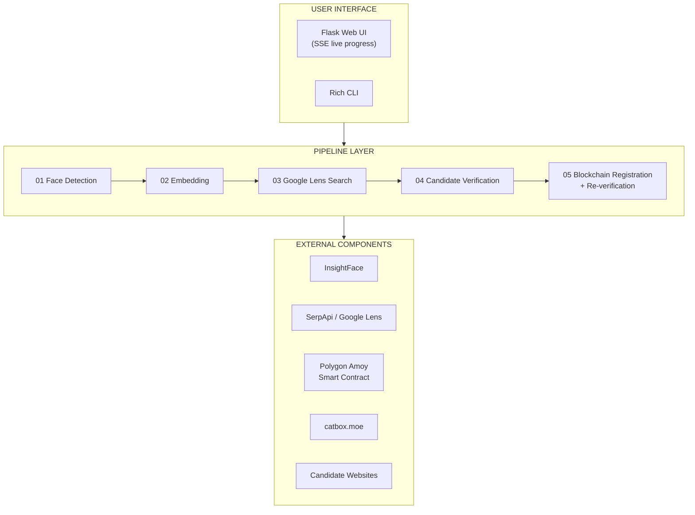
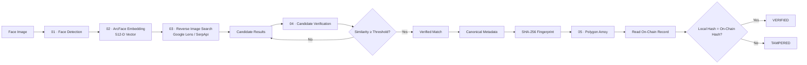
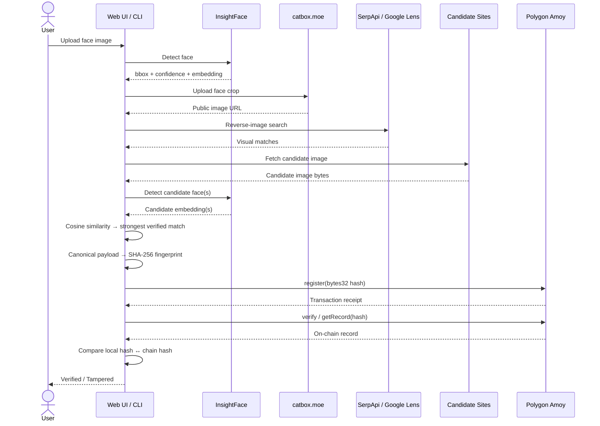
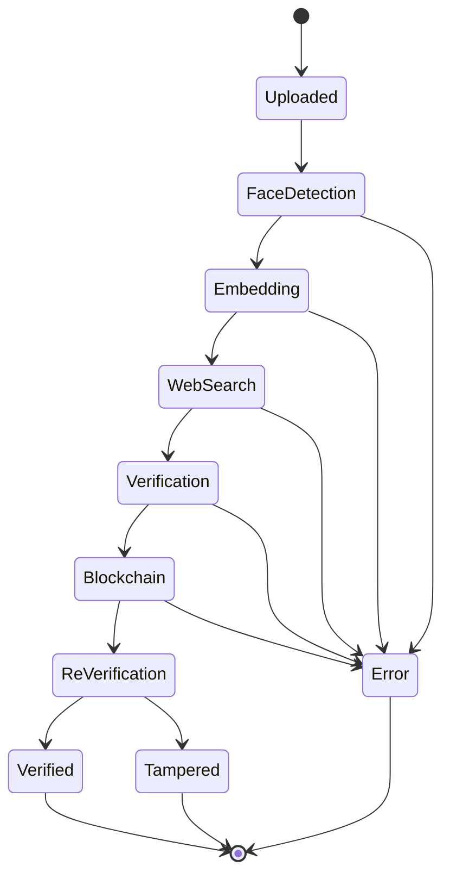
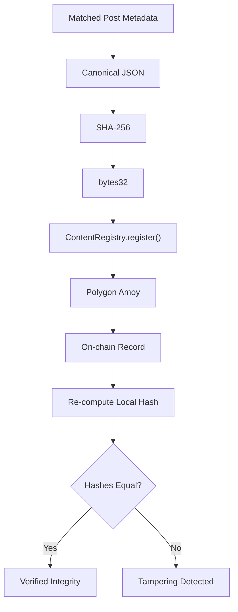

# Identity Signal — Face → Web → Blockchain

> **AI-powered face discovery with tamper-evident blockchain verification.**


Give it a face image: the pipeline finds the same person in a real web/social result, proves the match with face similarity, and anchors the content fingerprint on Polygon Amoy. No paid services, no heavy infra.

```
face.jpg → InsightFace (ArcFace) → Google Lens (SerpApi free) → social ranking
       → face re-check (cosine ≥ 0.40) → canonical JSON → SHA-256 (bytes32)
       → Polygon Amoy (ContentRegistry) → re-verify → tamper demo
```

Built for **HH GOA 2026 — Shortlisting Task 3**. Face scan, web/social search, matching post, blockchain fingerprint, and re-verification are all visible in one run — via the Flask web UI or the CLI.

### Contents

- [Why this stack](#why-this-stack-all-free--reliable)
- [What it does](#what-it-does)
- [Architecture](#architecture)
- [Data flow](#data-flow)
- [End-to-end sequence](#end-to-end-sequence)
- [Pipeline states](#pipeline-states)
- [Blockchain verification](#blockchain-verification)
- [Quick start](#quick-start)
- [Web API](#web-api)
- [Face matching](#face-matching)
- [Search strategy](#search-strategy)
- [Project structure](#project-structure)
- [Tests & diagnostics](#tests--diagnostics)
- [Limitations](#limitations-honest)
- [Security notes](#security-notes)
- [Roadmap](#roadmap)
- [License & credits](#license--credits)

---

## Why this stack (all free & reliable)

| Need | Choice | Why free & reliable |
|---|---|---|
| Face detect + embed | **InsightFace `buffalo_l` + ArcFace (ONNX Runtime CPU)** | MIT, runs locally, no API, no GPU, SOTA accuracy |
| Reverse image | **Google Lens via SerpApi** (`engine=google_lens`) | 100 searches/month free, no card, genuine live search every run. Fallback `--mock-search` for offline |
| Image hosting for search | **catbox.moe** | Free temporary public URL so Lens can fetch the query image |
| Similarity | Cosine on L2-normalised embeddings, `FACE_MATCH_THRESHOLD=0.40`, `PROBABLE_MATCH_THRESHOLD=0.30` (env-tunable) | — |
| Fingerprint | Canonical JSON (`sort_keys`, `separators=(',',':')`, UTF-8) → SHA-256 → `0x…` bytes32 | Deterministic, tiny on-chain cost |
| Blockchain | **Solidity 0.8.20 + web3.py + Polygon Amoy** (chainId 80002) | Free testnet POL via faucet, public RPC with automatic fallbacks, ~2-sec blocks |
| Web UI | **Flask + SSE streaming** | Live five-stage progress in the browser, no build step |
| CLI | **Rich** | Single terminal, clear 5-step flow for demo recording |

> Removed on purpose: paid search pools, hosted DBs, inference APIs, JS-framework frontends, local JSON "blockchain". They hide the 3 required stages and need paid keys. This repo keeps only what the spec asks for.

---

## What it does

### 01 — Detect the face

**InsightFace** (`buffalo_l`) detects faces locally and **ArcFace** generates a **512-dimensional embedding**.

```text
Input Image → Face Detection → Bounding Box + Confidence → 512-D ArcFace Embedding
```

### 02 — Search the web

The face crop is uploaded to `catbox.moe` for a public URL, which is sent to **Google Lens through SerpApi** for genuine reverse-image discovery. Results are deduplicated and social platforms are ranked first.

### 03 — Verify candidate faces

Search results are treated as **candidates**, not proof. Each candidate image is re-checked:

```text
Candidate Page → Candidate Image → Face Detection → ArcFace Embedding
    → Cosine Similarity → Confidence Tier (HIGH / PROBABLE / UNMATCHED)
```

This second layer stops a merely similar-looking image from counting as the same person.

### 04 — Fingerprint the match

The verified match becomes deterministic JSON and is hashed with **SHA-256**:

```json
{
  "url": "matched page URL",
  "platform": "source domain",
  "title": "page title",
  "image_url": "matched image URL",
  "similarity": 0.8231
}
```

The fingerprint is stored as a Solidity `bytes32`. Only the 32-byte hash goes on-chain — never the image.

### 05 — Anchor + re-verify on blockchain

The fingerprint is registered in `ContentRegistry.sol` on **Polygon Amoy** (hash, registrant, timestamp, block number). The record is read back and compared locally:

```text
Local Hash == On-Chain Hash  →  VERIFIED ✓
Local Hash != On-Chain Hash  →  TAMPERED ❌
```

---

## Architecture



---

## Data flow



---

## End-to-end sequence



---

## Pipeline states



The web UI streams these states as Server-Sent Events so the run is observable instead of a blank loader:

```text
step_started → step_progress → step_done → … → pipeline_done
```

---

## Blockchain verification



The chain stores the **fingerprint**, not the image — it is an integrity anchor, not a truth oracle for the source page:

```text
URL / Platform / Title / Image URL / Similarity
                  ↓
           Canonical JSON → SHA-256 → bytes32 → Polygon Amoy
```

The `--tamper-demo` flag modifies one field and re-hashes to show the mismatch (`0x8f31… != 0x19ab… → TAMPER DETECTED`).

### Smart contract

`contracts/ContentRegistry.sol` (MIT) stores a `Record { hash, registrant, timestamp, blockNumber, exists }`:

```solidity
register(bytes32 contentHash)                    // write
verify(bytes32) → bool                           // read
getRecord(bytes32) → (hash, registrant, timestamp, blockNumber, exists)
totalRecords() → uint256
event ContentRegistered(bytes32 indexed, address indexed, uint256, uint256)
```

| | |
|---|---|
| Network | Polygon Amoy Testnet |
| Chain ID | 80002 |
| Currency | POL (free via faucet) |
| RPC | Public endpoint with automatic fallbacks (no key needed) |
| Explorer | https://amoy.polygonscan.com |
| Faucet | https://faucet.polygon.technology/ (select Amoy) |
| Deployed contract | `0x082F1e254E3E68fd6b15Df24642607dfCEc47252` |

---

## Quick start

```bash
git clone https://github.com/Brajesh9373/fb-find.git
cd fb-find
git checkout pipeline-check

# Windows
python -m venv .venv
.venv\Scripts\activate

# macOS / Linux
python3 -m venv .venv
source .venv/bin/activate

pip install -r requirements.txt
cp .env.example .env   # Windows: copy .env.example .env
# edit .env — see below
```

> First run downloads the InsightFace model to `~/.insightface/` (~300 MB, once).

### 1. Free keys (1 minute)

**SerpApi (Google Lens)** — free, no card: https://serpapi.com/users/sign_up → Dashboard → API Key → `SERPAPI_KEY` in `.env`.

**Polygon Amoy POL** — free: create a throwaway wallet (e.g. MetaMask) → https://faucet.polygon.technology/ → select **Amoy** → fund it → wallet private key → `PRIVATE_KEY` in `.env` (never commit it).

`.env` essentials:

```env
SERPAPI_KEY=your_serpapi_key_here
PRIVATE_KEY=0x_your_throwaway_wallet_key
CONTRACT_ADDRESS=0x082F1e254E3E68fd6b15Df24642607dfCEc47252
POLYGON_RPC_URL=https://polygon-amoy.drpc.org
CHAIN_ID=80002
FACE_MATCH_THRESHOLD=0.40
PROBABLE_MATCH_THRESHOLD=0.30
MAX_CANDIDATES=30
MAX_CANDIDATES_TO_VERIFY=12
```

### 2. Deploy contract (free, or reuse the address above)

```bash
python scripts/deploy.py            # compiles + deploys, prints address → .env
python scripts/deploy.py --dry-run  # compile only
# Remix alternative: https://remix.ethereum.org → paste contracts/ContentRegistry.sol
# → Injected Provider (MetaMask on Amoy) → Deploy → copy address
```

### 3. Run it

```bash
# Web UI with live five-stage progress
python run_web.py                   # → http://127.0.0.1:5000 (or start.bat → option 1)

# Full CLI: face + live search + on-chain
python -m app.main --image samples/test.jpg --tamper-demo

# Face + search only (no blockchain)
python -m app.main --image samples/test.jpg --skip-blockchain

# Fully offline (no keys) — mock candidates
python -m app.main --image samples/test.jpg --mock-search --skip-blockchain --tamper-demo

# Tune threshold / verbosity
python -m app.main --image samples/test.jpg --threshold 0.60 --verbose
```

**Expected CLI:**

```
╭──────────────────────────────────────────╮
│  FACE → WEB → BLOCKCHAIN · HH GOA 2026   │
╰──────────────────────────────────────────╯

[1/5] Detecting face...          ✓ bbox=[...] 98.2%
[2/5] Generating embedding...    ✓ dim=512
[3/5] Searching web...           ✓ 12 candidates, 4 social
        #  Source         Title
        1  instagram.com  Technology Conference 2026
[4/5] Verifying candidates...
        Candidate #1  87.4%  ✓ MATCH
        ┌─ MATCH DISCOVERED ✓ ─┐  instagram.com  87.4%
[5/5] SHA-256...                 ✓ 0x8f31c9...
        Network: Polygon Amoy  Tx: 0x7a91...  Block: 12345678

        BLOCKCHAIN RE-VERIFICATION
        Local: 0x8f31c9...  Chain: 0x8f31c9...  ✓ VERIFIED

        ── TAMPER DEMO ──  title "2026"→"2027"  0x8f31... != 0x19ab...  ❌ TAMPER DETECTED
```

---

## Web API

| Endpoint | Description |
|---|---|
| `GET /` | Web interface (upload, live pipeline, signal report) |
| `GET /api/health` | Health check → `{"status": "ok"}` |
| `POST /api/analyze` | Image upload → pipeline via SSE stream |

Form fields: `image` (file, required), `threshold`, `skip_blockchain`, `tamper_demo`, `mock_search`. The response streams `face_detection → embedding → web_search → verification → blockchain`, and the Blockchain proof card surfaces the **final matched link** (most-similar source URL).

---

## Face matching

Cosine similarity between L2-normalised ArcFace embeddings, in three tiers:

| Tier | Meaning |
|---|---|
| HIGH | Meets `FACE_MATCH_THRESHOLD` (default 0.40) |
| PROBABLE | Meets `PROBABLE_MATCH_THRESHOLD` (default 0.30), used as fallback |
| UNMATCHED | Below probable threshold |

> Thresholds are application-specific — validate against real same-person / different-person examples before treating a score as an identity guarantee.

## Search strategy

Results are never accepted blindly. The search layer uploads the face crop, queries Google Lens, parses visual/exact matches, dedupes URLs, prioritises social platforms (`instagram > facebook > x > linkedin > threads > tiktok > youtube > pinterest`), re-detects faces in candidates, and keeps the strongest verified embedding match.

---

## Project structure

```text
fb-find/
├── app/
│   ├── face/          detector.py, embedder.py, similarity.py
│   ├── search/        lens.py, parser.py, ranking.py
│   ├── content/       extractor.py, canonicalizer.py, hashing.py, perceptual.py
│   ├── blockchain/    client.py, registry.py, verifier.py
│   ├── web/           routes.py, pipeline.py, templates/, static/
│   ├── cli/           display.py
│   ├── config.py
│   └── main.py
├── contracts/         ContentRegistry.sol, abi.json
├── scripts/           deploy.py, test_diagnostics.py
├── tests/             pytest, no keys needed
├── samples/  uploads/
├── run_web.py  start.bat  requirements.txt  .env.example
└── LICENSE (MIT)
```

---

## Tests & diagnostics

```bash
pytest -v
pytest --cov=app tests/
pytest tests/test_hashing.py -v  # determinism + tamper
pytest tests/test_face.py -v     # cosine
pytest tests/test_search.py -v   # parser + ranking
pytest tests/test_blockchain.py -v
python scripts/test_diagnostics.py  # env, SerpApi, RPC, wallet, models, hashing
```

All tests run offline — no RPC, no SerpApi key. Covered: canonical-JSON determinism, SHA-256/`bytes32`, cosine similarity, confidence tiers, result parsing, URL dedup, social ranking, chain verification states.

---

## Limitations (honest)

- SerpApi free = 100 searches/mo; on 429 use `--mock-search`.
- Social pages often need login; deleted/private/403/robots targets are skipped gracefully.
- Only the primary face per image is processed; accuracy depends on quality/pose/age.
- The query image is temporarily uploaded to `catbox.moe` — don't use sensitive images where public temp hosting is unacceptable.
- Testnet data ≠ production archive; chain storage proves fingerprint integrity, not source truthfulness.
- Public data only; blockchain stores the fingerprint, not the image.

---

## Security notes

- Never commit `.env`, private keys, uploads, or screenshots with secrets (`.env`, `uploads/`, `__pycache__/`, `.pytest_cache/`, `.venv/` are git-ignored).
- The wallet key lives only in the local environment — never in code, docs, recordings, or frontend JS.

---

## Roadmap

Concurrent candidate verification · threshold calibration on a validation set · privacy-preserving search infra · more search providers · persistent history · richer chain records · production object storage · rate limiting · source provenance · multi-face input · perceptual-hash (dHash) matching for crops/re-uploads.

---

## HH GOA 2026 — Task 3

```text
Face Scan → Web / Social Search → Matching Post → Blockchain Fingerprint → Re-verification
```

Suggested demo recording: Upload → Face Detected → Embedding → Search Results → Match Found → Blockchain Registration → Verified → Tamper Demo.

---

## License & credits

MIT — see `LICENSE`. Built with InsightFace, ArcFace, ONNX Runtime, Google Lens/SerpApi, Flask, web3.py, Solidity, Polygon Amoy, Python, Rich.

**Built for the signal, not the noise. Face → Web → Blockchain.**
